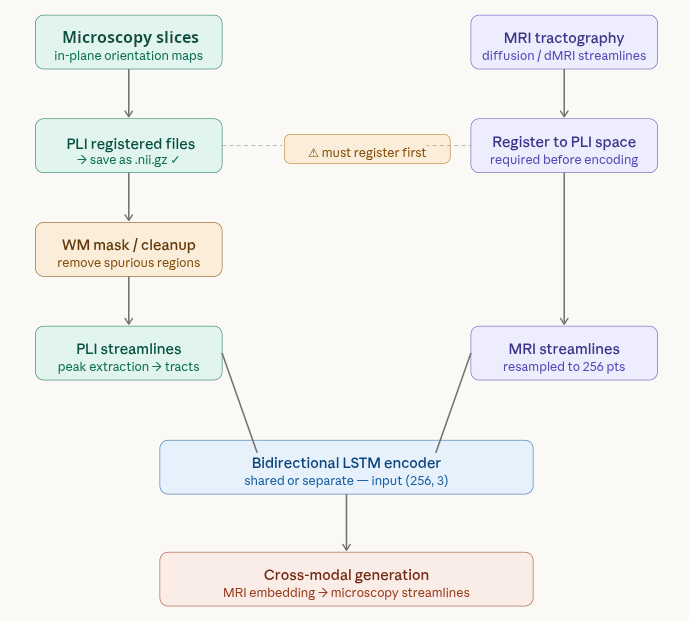
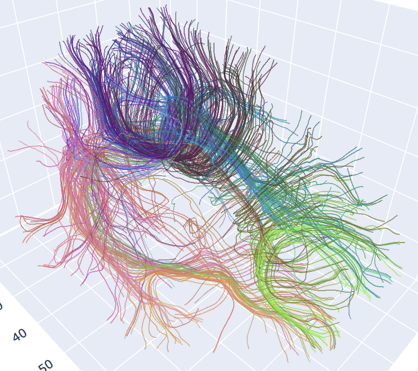

# Cross-Modal Tractography: MRI → Microscopy (PLI)

Master's thesis project. Generates microscopy (PLI) tractography from MRI
diffusion tractography using a cross-modal Variational Autoencoder. The two
modalities live in different coordinate frames with no streamline-level
correspondence; the VAE learns a geometry-level translation rather than a
point-to-point mapping.

## Repository layout

```
.
├── pipeline/              # Data-prep scripts (run in order; see below)
├── cross_modal_vae/       # VAE package: data, models, losses, training, evaluation
├── tests/                 # pytest suite mirroring cross_modal_vae/
├── scripts/               # End-to-end runner (e.g. run_full_pipeline.sh)
├── data/                  # Local-only; gitignored
│   ├── raw/               # Sample1_MRI/, Sample1_PLI/
│   ├── intermediate/      # PLI stack + ANTs-registered TIFF
│   └── processed/         # Registered .nii.gz, MRI .trk
├── img/                   # Diagrams used in this README
├── dsi_studio.app/        # Vendored DSI Studio (used by stage 1)
├── pyproject.toml         # uv project + pytest config
└── README.md
```

## Pipeline (data preparation)

Run from the repo root.

| Stage | Script | Output |
|-------|--------|--------|
| 1. MRI tractography (DSI Studio) | `pipeline/generate_streamlines_MRI.py` | `.trk` |
| 2. PLI preprocessing | `pipeline/preprocessing_pli.py` | series of `.tif` |
| 3. PLI self-registration (stack slices) | `pipeline/register_pli_stack.py` | `.nii.gz` |
| 4. PLI ↔ MRI registration *(optional)* | `pipeline/PLI_MRI_Registration.py` | `.nii.gz` |
| 5. PLI tractography | `pipeline/run_pli_tractography.py` | `.trk` |
| 6. Resample to fixed-length arrays | `cross_modal_vae/data/trk_to_npz.py` | `*_256pts.npz` |

Eddy-current artefacts in MRI should be removed beforehand (e.g. with FSL).

> The pipeline scripts use CWD-relative paths (e.g. `Sample1_MRI/Data/`,
> `registered_stack.nii.gz`). After the data move, point them at the new
> locations under `data/raw/`, `data/intermediate/`, `data/processed/` —
> either by editing the path constants at the top of each script or by
> running them from inside the matching `data/` subfolder.

## Training the VAE

```bash
uv sync --extra dev

uv run python -m cross_modal_vae.training.train \
    --mri  path/to/mri_256pts.npz \
    --pli  path/to/pli_256pts.npz \
    --out-dir cross_modal_vae/runs/exp1 \
    --device cuda
```

End-to-end (resample → train → generate):

```bash
MRI_TRK=path/to/mri.trk PLI_TRK=path/to/pli.trk OUT_DIR=runs/exp1 \
    scripts/run_full_pipeline.sh
```

## Tests

```bash
uv run pytest                              # full suite
uv run pytest tests/test_vae_forward.py    # single file
```

## Figures



